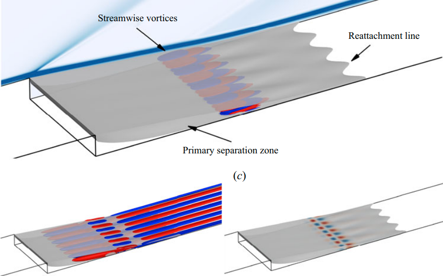
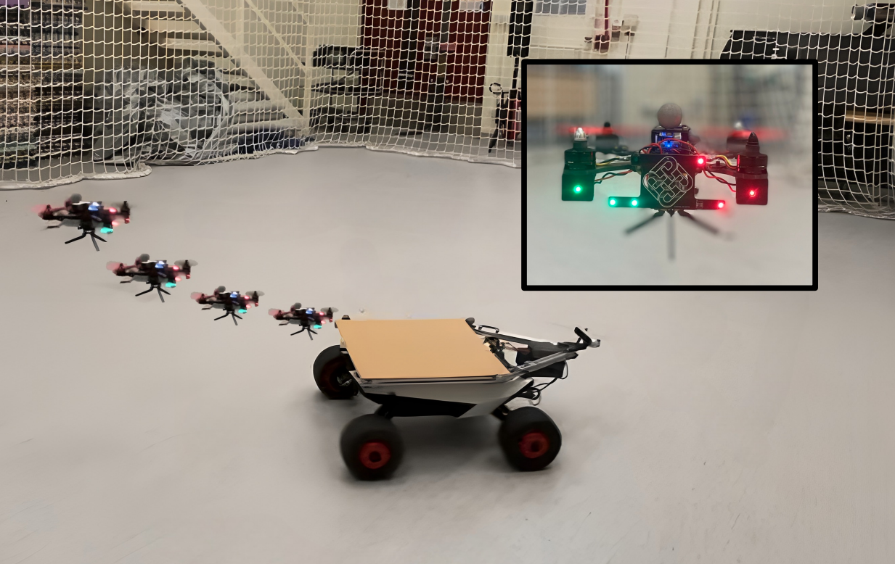
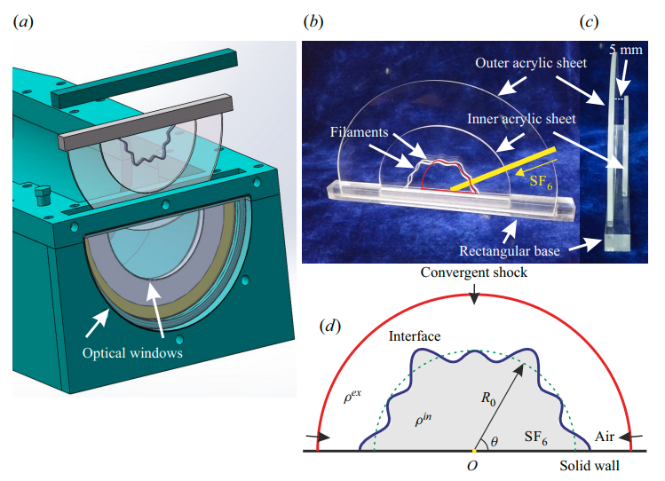
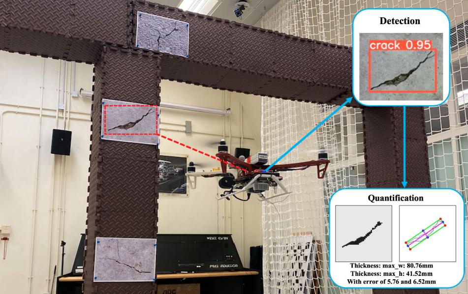
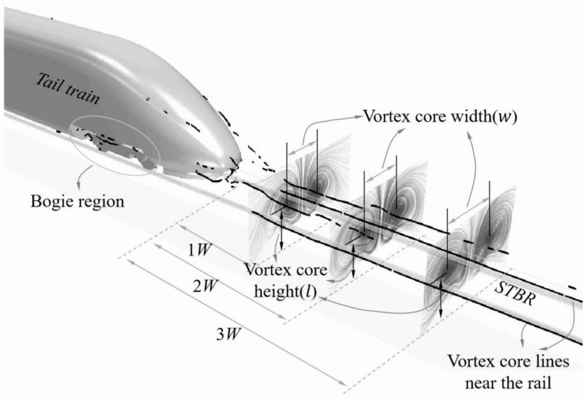

<!--   -->
<!-- Include Bootstrap CSS (You can use a CDN link) -->
<!-- <link rel="stylesheet" href="https://maxcdn.bootstrapcdn.com/bootstrap/4.5.2/css/bootstrap.min.css"> -->

<!-- Include Bootstrap JS (You can use a CDN link) -->
<!-- 

 -->

# About Us

        

 
Welcome to the High-speed Thermo-fluid and MAV/UAV Laboratory (HTML) at The Hong Kong Polytechnic University, led by Prof. Chih-Yung Wen. Our research focuses on two main areas: Fluid Dynamics and Robotics.

In Fluid Dynamics, we investigate high-speed flow, dielectric barrier discharge (DBD) plasma actuators, and urban CFD simulations. In Robotics, we collaborate with the Research Centre for Unmanned Autonomous Systems to develop advanced unmanned aerial vehicles (UAVs) and micro aerial vehicles (MAVs), enhancing their autonomy and efficiency.

By integrating our fluid dynamics expertise with robotics, we strive to push the boundaries of what is possible in both fields, contributing to advancements in aerospace engineering and autonomous systems. Feel free to browse through our <a href="/publications">(research paper)</a> and <a href="https://github.com/HKPolyU-UAV">(code)</a>; drop us an email for any discussion!    

  <!-- Indicators -->
  <ul class="carousel-indicators">
    <li data-target="#imageCarousel" data-slide-to="0" class="active"></li>
    <li data-target="#imageCarousel" data-slide-to="1"></li>
    <li data-target="#imageCarousel" data-slide-to="2"></li>
    <li data-target="#imageCarousel" data-slide-to="4"></li>
    <li data-target="#imageCarousel" data-slide-to="5"></li>
  </ul>

  <!-- The slideshow -->
  

    

      
    

    

      
    

    

      
    

    

      
    

    

      
    

  

  <!-- Left and right controls -->
  <a class="carousel-control-prev" href="#imageCarousel" data-slide="prev">
    
  </a>
  <a class="carousel-control-next" href="#imageCarousel" data-slide="next">
    
  </a>

 
