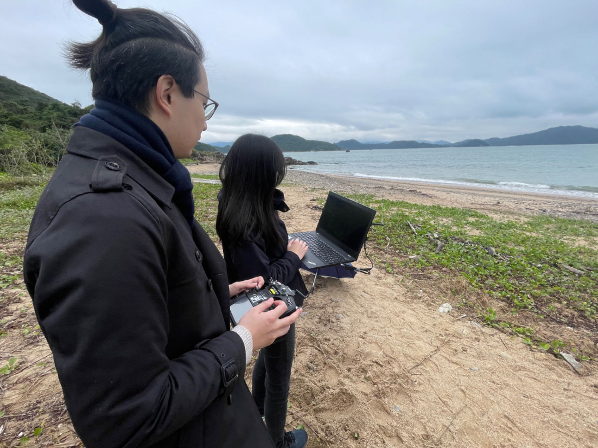
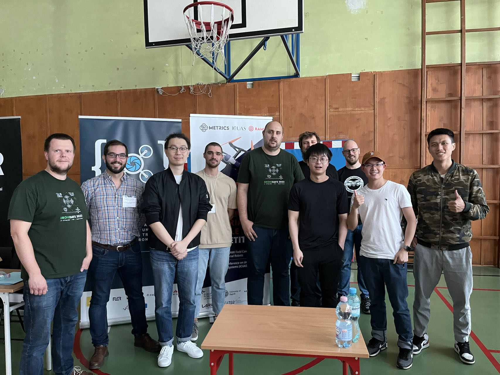
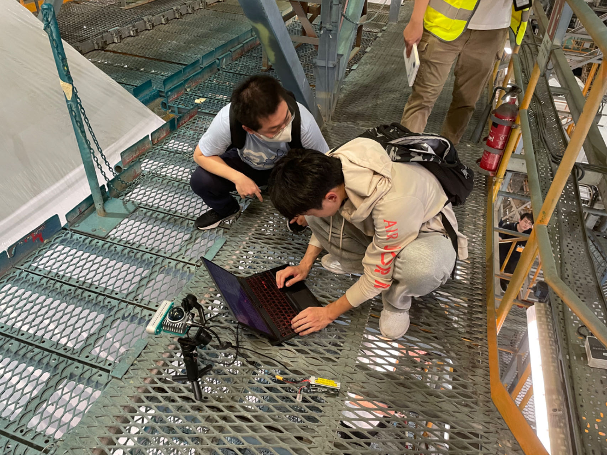

# Join Us!

<!--   -->
<!-- Include Bootstrap CSS (You can use a CDN link) -->
<!-- <link rel="stylesheet" href="https://maxcdn.bootstrapcdn.com/bootstrap/4.5.2/css/bootstrap.min.css"> -->

  <!-- Indicators -->
  <ul class="carousel-indicators">
    <li data-target="#imageCarousel" data-slide-to="0" class="active"></li>
    <li data-target="#imageCarousel" data-slide-to="1"></li>
    <li data-target="#imageCarousel" data-slide-to="2"></li>
  </ul>

  <!-- The slideshow -->
  

    

      
    

    

      
    

    

      
    

  

  <!-- Left and right controls -->
  <a class="carousel-control-prev" href="#imageCarousel" data-slide="prev">
    
  </a>
  <a class="carousel-control-next" href="#imageCarousel" data-slide="next">
    
  </a>

<!-- Include Bootstrap JS (You can use a CDN link) -->
<!-- 

 -->

Our team recruit Ph.D students, post-doc and research personnel (RAs) in the area of fluid dynamic and UAV system. We also welcome PolyU undergraduate and MSc students doing the FYP/dissertation in the relative area. Feel free to contact us via email, or drop a message to our lab members!

For prospective researchers, please send your CV to Prof. Wen at: <a href="mailto:chihyung.wen@polyu.edu.hk">chihyung.wen@polyu.edu.hk</a>
We offer following research positions:

    1,Ph.D studentship(1-2 per year)

    2,Hong Kong Ph.D Fellowship Scheme(no quota limit)

    3,Research Assistant/Associate positions(regularly)

    4,Project Fund Postdoctoral Fellowship(regularly)

For MSc dissertation and FYP, Please check our <a href="https://www.polyu.edu.hk/en/aae/">department website</a> and email. We also welcome you to visit our lab.
