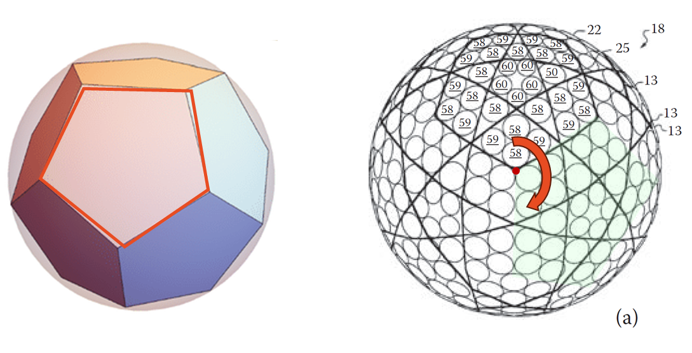
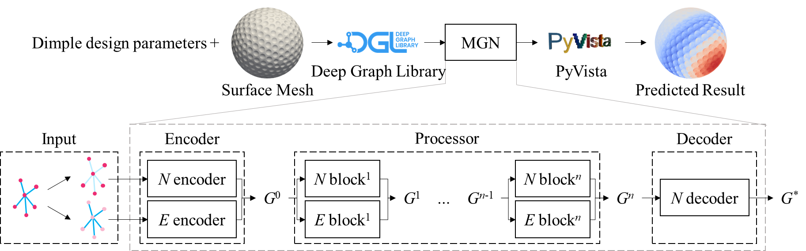
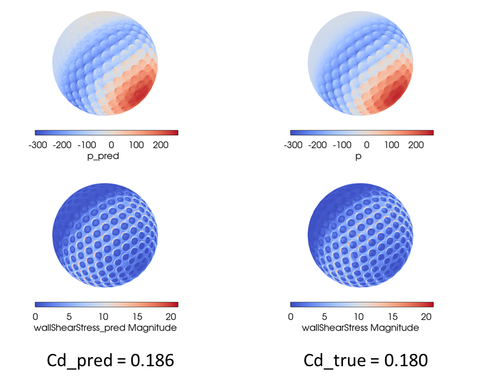
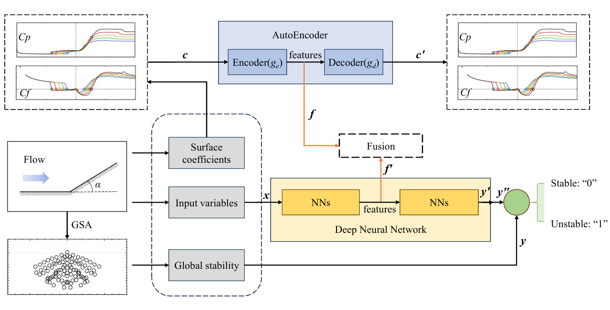
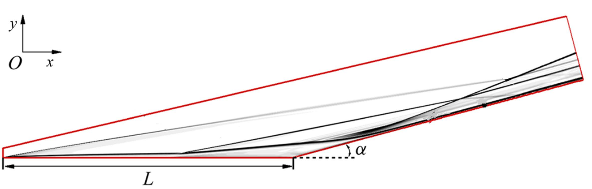
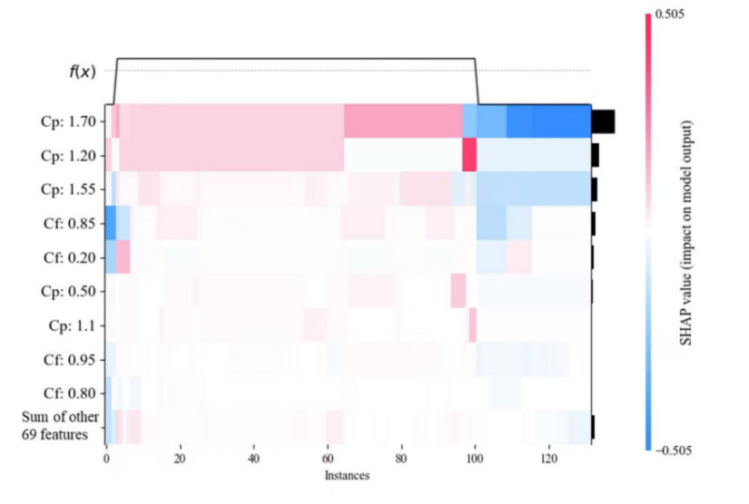
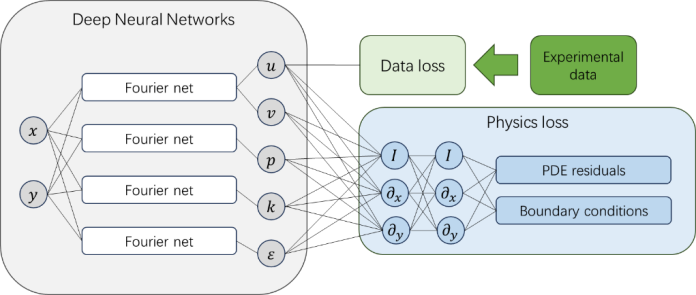
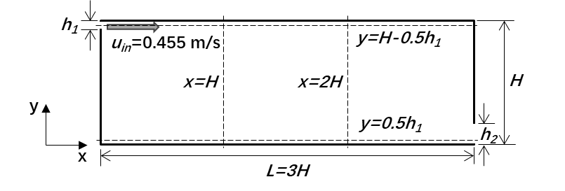
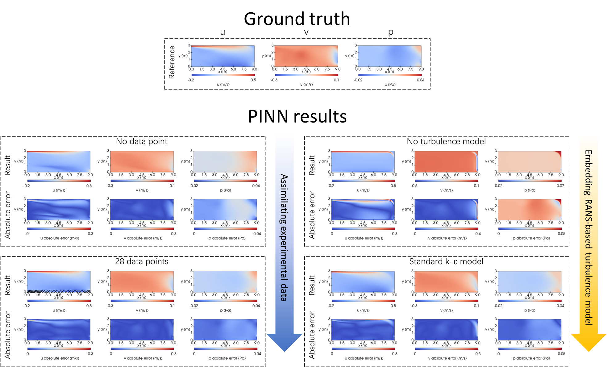

# 1. Graph-based deep learning for golf ball design

The intricate geometric shape of golf balls, coupled with the need to undergo flow transitions and significant flow separation during flight, poses substantial challenges for rapid aerodynamic prediction. These challenges can considerably slow down the design iteration process of golf balls. To reduce the high costs associated with three-dimensional (3D) aerodynamic numerical simulations and to overcome the limitations of traditional pixel-based learning methods in handling complex geometric shapes, we propose the use of a mesh-based learning approach utilizing deep learning graph neural networks (GNNs) which encodes spatial mesh information and corresponding physical aerodynamic parameters into a graph, achieving end-to-end mapping. The trained model can be used to predict the changes in drag coefficient, surface pressure, and wall shear stress caused by variations in the geometry of the golf ball, 1-2 orders of magnitude faster than the computational fluid dynamics (CFD) simulations, significantly accelerate the design space exploration of golf ball aerodynamic performance.

  

Figure 1. Effect of dimple design on aerodynamics of golf ball

  

Figure 2. Golf ball design with Platonic solids

  

Figure 3. MeshGraphNet for rapid aerodynamic prediction (N, node; E, edge; G, graph)

  

Figure 4. Comparison of GNN-based aerodynamics predictions and CFD results

# 2. Multi-source hypersonic data fusion neural network for global stability prediction

XMHH-Net: explainable heterogeneous hypersonic data fusion neural network for the global stability prediction of compression corner flow. In contrast to traditional global stability analysis (GSA), this approach reduces the time by five orders of magnitude, thereby enhancing the efficiency of flow field stability assessment. Additionally, compared to deep neural network (DNN) utilizing single source data, this method incorporates surface coefficients of pressure coefficient and friction coefficient for data fusion, promoting explainability.

  

Figure 5. The flowchart of XMHH-Net

  

Figure 6.1. The configuration of compression corner and measure points locations

  

Figure 6.2. Analysing the direct impact of each feature on predicting global stability for explainability. The result aligns with the findings of the former theoretical study [1]

[1] J. Hao, S. Cao, C.-Y. Wen, H. Olivier, Occurrence of global instability in hypersonic compression corner flow, Journal of Fluid Mechanics 919 (2021) A4.

# Physics-informed neural networks for indoor airflow simulation

Physics-informed neural network (PINN) has aroused broad interest among fluid simulation researchers in recent years, representing a novel paradigm in this area, where governing differential equations are encoded to provide a hybrid physics-based and data-driven deep learning framework. Our research applies the PINN to simulate a two dimensional (2D) indoor turbulent airflow case, enhancing its prediction accuracy with experimental data and Reynolds-averaged Navier-Stokes turbulence model.

  

Figure 7.1. Neural network architecture of PINN

  

Figure 7.2. Schematic of a 2D room

  

Figure 8. Enhancing the accuracy of PINN using experimental data and RANS turbulence model

