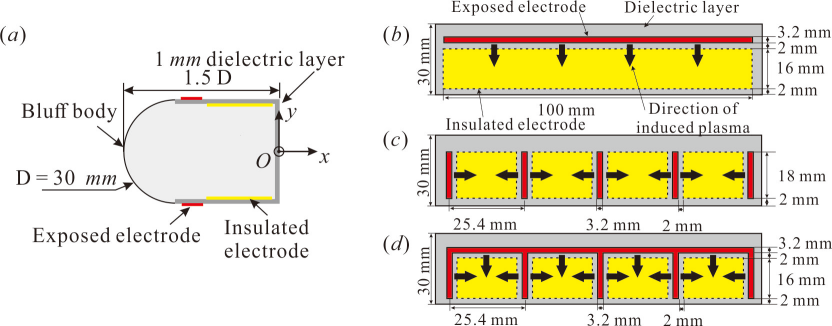
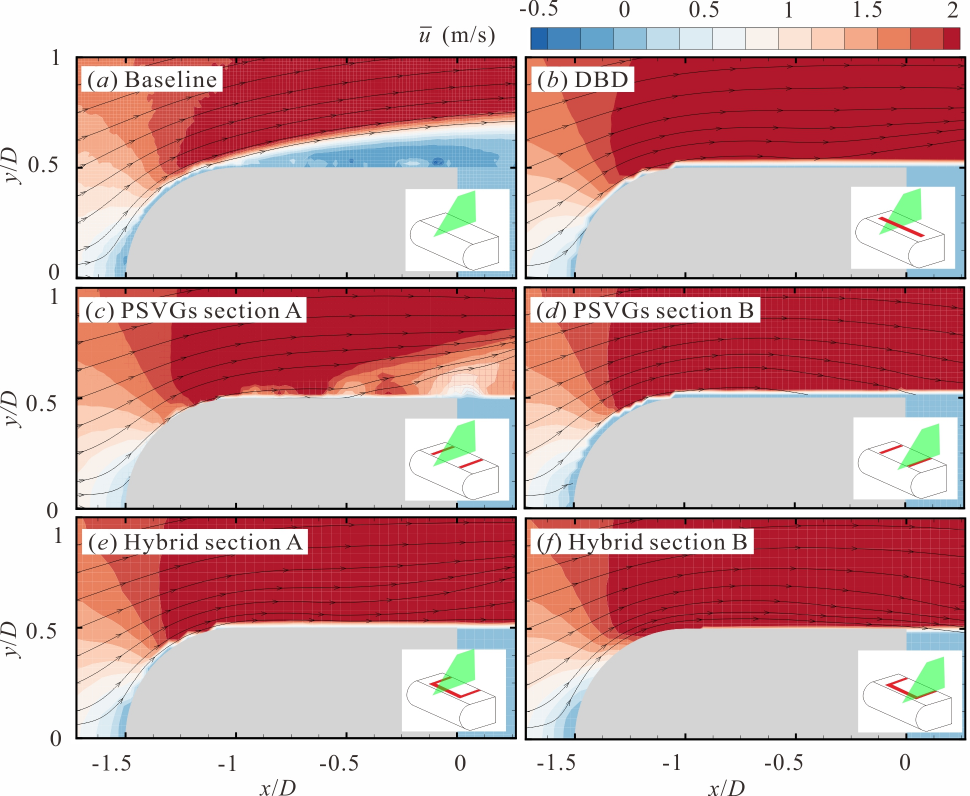
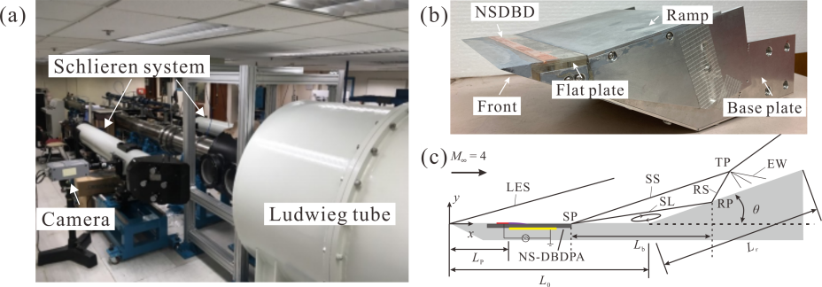
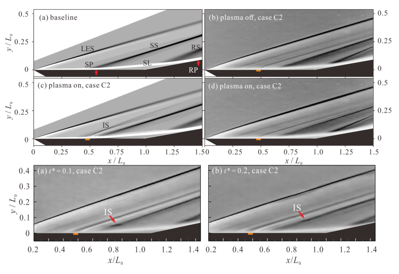
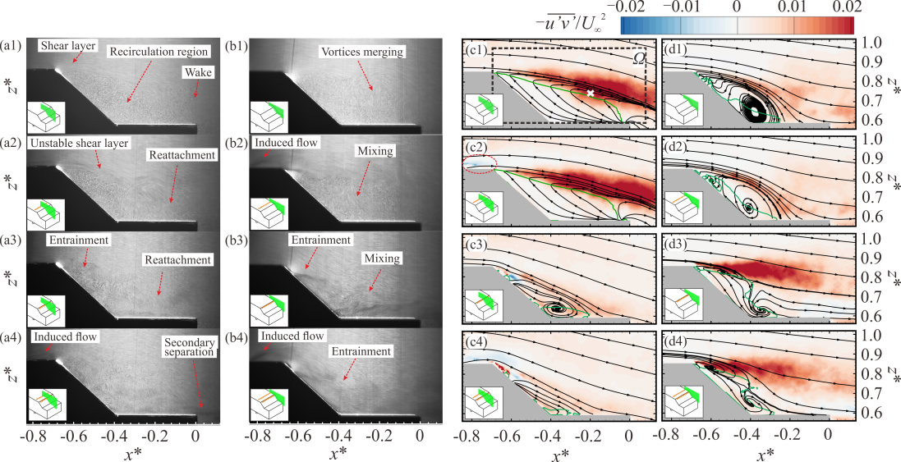

The dielectric barrier discharge (DBD) plasma actuator has gained great popularity in active flow control in the past decade because of its extremely fast response, light weight, flexibility to be installed and the low power consumption. It has been widely applied for drag reduction, separation control, lift enhancement, noise control and maneuvering.
 

  

  Figure 0. Schematic of the AC-DBD and NS-DBD plasma actuator

# 1. Applications for flow control over a delta wing

  <iframe style="position: absolute; top: 0; left: 0; width: 100%; height: 100%;" src="https://www.youtube.com/embed/qMcscpDLkC0?si=hDOajaby2chOp-9T" frameborder="0" allow="accelerometer; autoplay; encrypted-media; gyroscope; picture-in-picture" allowfullscreen></iframe>

  Video 1. The smoke flow visualization reveals that the DBD plasma actuators at the leading edges significantly modify the vortical flow structure over the delta wing. It is noted that symmetric control at both semi-spans and asymmetric control at a single semi-span leads to opposite effects on the local LEVs. Particle image velocimetry (PIV) indicates that the shear layer is deformed by the actuators. Therefore, both the strength and the shape of the LEV cores are deeply affected. The six-component force measurement shows that the DBD plasma actuators have a limited effect on lift and drag while inducing relatively large moments

  

  Figure 1a. Smoke flow visualization results show the typical LEV structure in the transverse cross-section: (a) baseline case; (b) symmetric control case; and (c) asymmetric control (starboard-controlled) case

  

  Figure 1b. PIV results showing the dimensionless vorticity contours

# 2. Flow control of a D-shaped bluff wake

The stable controlled vortex shedding system can reduce the effect of the natural frequency of the bending stiffness-dominated cylinder structure system, thus avoiding the occurrence of resonance in advance. The reduction in drag and lateral lift oscillation are studied by mapping the changes in force coefficients and fluctuations as a function of Reynolds number. A comparison of these plasma actuators shows that the hybrid actuator achieves best drag reduction, suppression of lift oscillation, and Kármán vortex shedding in the wake at low speed, because three-dimensional flow structures are generated on the surface of the bluff body that consequently enhance the mixing. The results suggest that PSVGs and ameliorative actuators are promising for wake flow control in bluff bodies at low speeds.

  

  Figure 2a. Schematic of the half-cylindrical head cylinder. Configurations and different DBD plasma actuators

  

  Figure 2b. Separation control over the model surface

# 3. Control of supersonic compression corner flow
The results indicate that the discharge induces a pressure rise and leads to misalignment between the pressure gradient and density gradient in the residual heat region. Because of the interaction between the supersonic freestream and the actuation-induced shock/ compression flow, convection, compressibility of the fluid element, and baroclinicity of the residual heat region collectively lead to the formation of an induced spanwise vortex, which in turn enables momentum migration. The induced vortex disrupts the initial flow structures and entrains high-energy fluid from the main flow into the boundary layer, promoting momentum mixing between the main flow and the separated flow, which increases the energy of the boundary layer to resist the adverse pressure gradient. The time-averaged flow structures imply that it is possible to totally eliminate the flow separation near the supersonic compression corner. For aerodynamics on the surface, the normal force produces a pitching moment that can be potentially utilized to control the body’s orientation and trajectory. Additionally, total drag on the surface can be reduced by 5 %. This suggests that choosing the most appropriate position based on its local fluid characteristics can strongly increase the control effectiveness.

  

  Figure 3a. Experimental setups

  

  Figure 3b. Time-averaged experimental Schlieren images and induced shock propagation of the NSDBD plasma actuator

  <iframe style="position: absolute; top: 0; left: 0; width: 100%; height: 100%;" src="https://www.youtube.com/embed/DW5V9135-xQ?si=xw76KSn7eUSuqZo1" frameborder="0" allow="accelerometer; autoplay; encrypted-media; gyroscope; picture-in-picture" allowfullscreen></iframe>

  Video 3a. Numerical Schlieren of a single NSDBD pulse in a Mach 4 compression corner flow

  <iframe style="position: absolute; top: 0; left: 0; width: 100%; height: 100%;" src="https://www.youtube.com/embed/pnXlPN10MC8?si=U6dmqvHkknM9Fx6z" frameborder="0" allow="accelerometer; autoplay; encrypted-media; gyroscope; picture-in-picture" allowfullscreen></iframe>

  Video 3b. Residual heat of a single NSDBD pulse in a Mach 4 compression corner flow

  

  Figure 3c. Time-averaged flow structures and friction coefficient

# 4. Thermal effects of DBD plasma actuators
Different discharge modes and discharge parameters exhibit markedly different thermal performances. Also, the Schlieren technique and the pressure sensor are used to visualize the induced shock wave, estimate the thermal expansion region, and measure the overpressure strength. The results of the overpressure strength at different air pressures are similar to the thermal features, which highlights the strong influence of the discharge mode on the thermal effect of NSDBD plasma actuators.

  

  Figure 4a. (a) Lissajous figures; time histories of; (b) cold capacitance and; (c) effective capacitance; and (d) the capacitance versus Vpp3.5 

  

  Figure 4b. Images of the discharge at different gas pressures of NSDBD

  <iframe style="position: absolute; top: 0; left: 0; width: 100%; height: 100%;" src="https://www.youtube.com/embed/S2tJC4rMPxQ?si=zzt8xsWUToZU4Jma" frameborder="0" allow="accelerometer; autoplay; encrypted-media; gyroscope; picture-in-picture" allowfullscreen></iframe>

  Video 4a. Evolution of residual heat of the NSDBD

  <iframe style="position: absolute; top: 0; left: 0; width: 100%; height: 100%;" src="https://www.youtube.com/embed/wIFUBaATvYg?si=nfB9jurXkCw0mE8k" frameborder="0" allow="accelerometer; autoplay; encrypted-media; gyroscope; picture-in-picture" allowfullscreen></iframe>

  Video 4b. Surface temperature distributions of the NSDBD

# 5. Flow control of a notch-back Ahmed body
The induced flow upstream of the slant enhances the momentum in the boundary layer, marginally reducing the separation and drag. However, the activation located at the leading edge of the slant almost completely suppresses the central large-scale separation, facilitating the reattachment of the separated shear layer to the deck surface. The reattachment leads to a consequential intensification of the C-pillar vortices, causing a deviation in their trajectories outward and an increase in drag. This suggests that the PSVG is a promising technique for automobile wake control. The activation location leads to different flow structures, implying various control mechanisms. For further drag reduction, both suppressing wake separation and mitigating longitudinal vorticity should be considered.

  

  Figure 5. The smoke visualization and PIV results

  <iframe style="position: absolute; top: 0; left: 0; width: 100%; height: 100%;" src="https://www.youtube.com/embed/lfgT82HcymY?si=PFhqCgdpWlEIBr5X" frameborder="0" allow="accelerometer; autoplay; encrypted-media; gyroscope; picture-in-picture" allowfullscreen></iframe>

  Video 5a. Notchback Ahmed body flow (Re = 5000) without control

  <iframe style="position: absolute; top: 0; left: 0; width: 100%; height: 100%;" src="https://www.youtube.com/embed/44Bpvnap-p0?si=Z5BLj9Q2T4tUdk2P" frameborder="0" allow="accelerometer; autoplay; encrypted-media; gyroscope; picture-in-picture" allowfullscreen></iframe>

  Video 5b. Notchback Ahmed body flow (Re = 5000) with both actuators’ control

