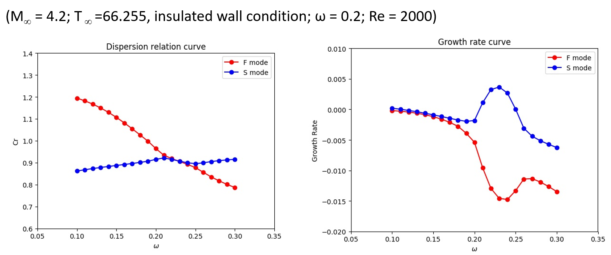

# 1. Hypersonic Transiton
Laminar-to-turbulent transition generates significant increase in viscous drag and heat flux, leading to severe restrictions on the performance and thermal protection system of hypersonic vehicles. Estimate for the National Aerospace Plane (NASP) shows that the pay-load-to-gross-weight ratio would nearly double if the vehicle boundary layer is fully laminar, compared to fully turbulent .Early transition also causes higher heating, which then requires an increased performance thermal protection system (TPS), active cooling, or trajectory modification, leading to higher cost and weight of hypersonic vehicles. In order to investigate the mechanism and possible transition control methods, extensive works have been carried out in our lab.

  

Figure 1. Transition phenomenon

# 2. Wind Tunnel-Ludwieg Tube

  

Figure 2. Wind Tunnel-Ludwieg Tube

# Numerical Wind Tunnel
For simple configurations, such as flat-plate, cones and corners, high-order accuracy schemes are employed to directly simulate the stability and transition phenomena. We also developed in-house code for engineering transition prediction, including empirical models, transition models and large eddy simulation.
## 3.Study on the effect of local heating/cooling
A suction-blowing disturbance is introduced at the leading edge. When the disturbance is fully developed, a heating /cooling element is active.

Local heating effect on the stability

  

    <iframe style="position: absolute; top: 0; left: 0; width: 100%; height: 100%;" src="../assets/img/HT/hta.gif" frameborder="0" allow="accelerometer; autoplay; encrypted-media; gyroscope; picture-in-picture" allowfullscreen></iframe>
  

3a. Pressure evolution 

  

    <iframe style="position: absolute; top: 0; left: 0; width: 100%; height: 100%;" src="../assets/img/HT/htb.gif" frameborder="0" allow="accelerometer; autoplay; encrypted-media; gyroscope; picture-in-picture" allowfullscreen></iframe>
  

3b. Fluctuating pressure evolution 

  

    <iframe style="position: absolute; top: 0; left: 0; width: 100%; height: 100%;" src="../assets/img/HT/htc.gif" frameborder="0" allow="accelerometer; autoplay; encrypted-media; gyroscope; picture-in-picture" allowfullscreen></iframe>
  

3c. Wall fluctuating pressure evolution 

# 4. Stability study on the effect of roughness

A suction-blowing disturbance is introduced at the leading edge. The animation below shows effect of roughness on the evolution of unstable waves.

  

    <iframe style="position: absolute; top: 0; left: 0; width: 100%; height: 100%;" src="../assets/img/HT/HT4.gif" frameborder="0" allow="accelerometer; autoplay; encrypted-media; gyroscope; picture-in-picture" allowfullscreen></iframe>
  

4. Fluctuating pressure evolution, with pressure contour as the background

# 5.Stability study on the effect of wavy wall

A suction-blowing disturbance is introduced at the leading edge. The animation below shows effect of waviness on the evolution of unstable waves.
A suction-blowing disturbance is introduced at the leading edge. The animation below shows effect of roughness on the evolution of unstable waves.

  

    <iframe style="position: absolute; top: 0; left: 0; width: 100%; height: 100%;" src="../assets/img/HT/HT5.gif" frameborder="0" allow="accelerometer; autoplay; encrypted-media; gyroscope; picture-in-picture" allowfullscreen></iframe>
  

5. Fluctuating pressure evolution, with pressure contour as the background

# 6.Stability study on the effect of ART material

We also focus on the stabilization effect of acoustic rainbow trapping metal-material (ART) on hypersonic boundary-layer.

  

    <iframe style="position: absolute; top: 0; left: 0; width: 100%; height: 100%;" src="../assets/img/HT/HT6.png" frameborder="0" allow="accelerometer; autoplay; encrypted-media; gyroscope; picture-in-picture" allowfullscreen></iframe>
  

6. Fluctuating pressure evolution, with pressure contour as the background

  

7. Engineering predication

# 8. Linear Stability Analysis

In order to help interpret the characteristics of instability, we also developed LST codes to calculate the unstable wav

  

8a. Discrete modes F and S evolution

  

8b. Discrete modes F and S evolution

# 9. Impedance-near-zero metasurface

  

9a. How to obtain the impedance-near-zero metasurface

  

9b. How to obtain the impedance-near-zero metasurface

Direct numerical simulation of fluctuating pressure fields when hypersonic flow passes the metasurface. Problem formulation is as for Fig. 2(a) except that the metasurface is only located at x = 0.12-0.18 m to save computational resource. (a) Fluctuating pressure amplitude contours for rigid boundary (upper), impedance-matched metasurface (middle), and impedance-near-zero metasurface (lower), with the corresponding zoom-in views shown in the right column. (b) Comparisons of fluctuating pressure along the surface (y = 0) for different boundaries. (c) Comparisons of energy density at (x, y) = (0.16 m, 0 m) for different boundaries. In (b) and (c), the black line represents data for the rigid boundary, the blue line for the impedance-matched metasurface, and the red line for the impedance-near-zero metasurface.

  

9c. Fluctuating pressure evolution along the impedance-matched metasurface

  

9d. Fluctuating pressure evolution along the impedance-matched metasurface

