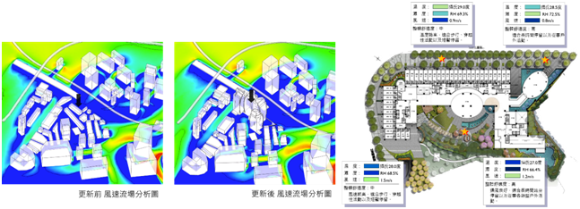

# 1. External Environment Analysis

  

Figure 1. Analysis of the Cooling Effects by Vegetation for Improving the Outdoor Thermal Environment in Public Park in Subtropical Taipei Taiwan

  

Figure 2. Myth of ecological architecture designs: Comparison between design concept and computational analysis results of natural-ventilation for tjibaou cultural center in New Caledonia

  

Figure 3. Research Projects: Simulation of Urban Renewal Investigate

# 2. Internal Environment Analysis

  

Figure 4. Research Projects: Simulation of Urban Renewal Investigate

  

Figure 5. Research Projects: Simulation of HVAC System Design

  

Figure 6. Research Projects: Simulation of HVAC System Design

